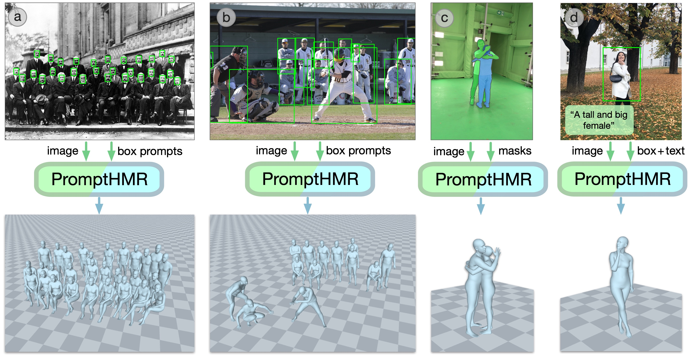

## PromptHMR 
Official implementation for the paper (CVPR25): \
**PromptHMR: Promptable Human Mesh Recovery**  
[Yufu Wang](https://yufu-wang.github.io), [Yu Sun](https://www.yusun.work), [Priyanka Patel](https://pixelite1201.github.io), [Kostas Daniilidis](https://www.cis.upenn.edu/~kostas/), [Michael J. Black](https://ps.is.mpg.de/person/black), [Muhammed Kocabas](https://ps.is.mpg.de/person/mkocabas)\
[[Project Page](https://yufu-wang.github.io/phmr-page)]
[[Arxiv](https://arxiv.org/abs/2504.06397)]



https://github.com/user-attachments/assets/92c0f0dc-ae3b-45e2-9e80-9f67b26acbbd

https://github.com/user-attachments/assets/cffe7c2c-a415-43fb-900a-1b2f287caff7

https://github.com/user-attachments/assets/10fe1f00-b517-4b63-bea6-68aa99f0d81c


## Installation
1. Clone this project.
```Bash
git clone https://github.com/yufu-wang/phmr_dev
```
2. Run installation script to create a conda environment and install requirements. We provide two options: either torch==2.4.0+cu121 (pass `--pt_version=2.4`) or torch==2.6.0+cu126 (pass `--pt_version=2.6`). (Optional) If you want to run the world-coordinate multi-human video pipeline, you will need additional thirdparty packages.
```Bash
Usage: scripts/install.sh --pt_version <version> [--world-video=<true|false>]

Options:
  --pt_version <version>       PyTorch version to install (2.4 or 2.6)
  --world-video <true|false>   Download required wheels for world-coordinate multi-human video (default: false)
  --help                       Show this help message

Examples:
  scripts/install.sh --pt_version=2.4
  scripts/install.sh --pt_version=2.6
  scripts/install.sh --pt_version=2.4 --world-video=true
  scripts/install.sh --pt_version=2.6 --world-video=false
```

## Prepare data
Run the following commands to download all models and checkpoints into the `data/` directory. The first command will prompt you to register and log in to access each version of SMPL.
```Bash
# SMPLX family models
bash scripts/fetch_smplx.sh

# Checkpoints and annotations
bash scripts/fetch_data.sh
```


## Demos
**For monocular reconstruction**, the demo saves results in a new folder named after the input image. It also uses Viser to visualize the results—open the output link in a browser to view them in 3D. If the browser cannot connect, please troubleshoot Viser (e.g., port forwarding is required if you're running on a remote server).

```bash
# 1. Single view reconstruction
python scripts/demo_phmr.py --image data/examples/example_1.jpg --gravity_align
```

**For world-coordinate video reconstruction**, first install the precompiled wheels as described in our installation guide. After installation, run the example commands below—results will be visualized using Viser.
If you're working with a long sequence containing many people, consider using `--viser_total` to limit the number of frames visualized, or `--viser_subsample` to subsample frames.
For other hyperparameters, refer to `pipeline/config.yaml`.

```bash
# 2. Video world-coordinate reconstruction
# Example 1: simple example
python scripts/demo_video.py --input_video data/examples/boxing.mp4

# Example 2: with static camera
python scripts/demo_video.py --input_video data/examples/dance_1.mp4 --static_camera --viser_subsample 4 

# Example 3: moving camera
 python scripts/demo_video.py --input_video data/examples/dance_2.mp4 --viser_subsample 3

```

Note that this script will output MCS and GLB files. You can drag and drop the MCS file to [https://me.meshcapade.com/editor](https://me.meshcapade.com/editor) to view the results. You can import the GLB file into the Blender editor to visualize human and camera motion.

**Note on Viser**: If you're running the demo on a server and viewing it through a local browser, the meshes are streamed to the browser's memory, which can be slow for long sequences with many people. A potential workaround is to download the `results.pkl` file and modify the demo to load and visualize the results locally.

## Evaluation
Please update the dataset directory in `data_config.py`, and then run the following command for pose and shape evaluation.
```bash
# Available datasets: EMDB, 3DPW_TEST, HI4D_TEST, RICH_TEST
python scripts/eval_phmr.py --dataset EMDB
```

## Training
Due to licensing agreements, we currently do not plan to release the training code. For details related to training, please refer to the paper and its supplementary materials.


## Acknowledgements
We benefit greatly from the following open source works, from which we adapted parts of our code.
- [SAM](https://github.com/facebookresearch/segment-anything): promptable architecture
- [MultiHMR](https://github.com/naver/multi-hmr) & [BEV](https://www.yusun.work/BEV/BEV.html): multi-person baseline
- [GVHMR](https://github.com/zju3dv/GVHMR): video head design
- [CamHMR](https://github.com/pixelite1201/CameraHMR): annotations
- [BUDDI](https://github.com/muelea/buddi): two-person interation
- [viser](https://github.com/nerfstudio-project/viser) & [Gloss](https://github.com/Meshcapade/gloss): visualization

In addition, the pipeline includes [Detectron2](https://github.com/facebookresearch/detectron2), [SAM2](https://github.com/facebookresearch/sam2), [DROID-SLAM](https://github.com/princeton-vl/DROID-SLAM), [Metric3D](https://github.com/YvanYin/Metric3D), [ViTPose](https://github.com/ViTAE-Transformer/ViTPose) and [SPEC](https://github.com/mkocabas/SPEC).


## Citation
```bibtex
@article{wang2025prompthmr,
  title={PromptHMR: Promptable Human Mesh Recovery},
  author={Wang, Yufu and Sun, Yu and Patel, Priyanka and Daniilidis, Kostas and Black, Michael J and Kocabas, Muhammed},
  journal={Proceedings of the IEEE/CVF Conference on Computer Vision and Pattern Recognition},
  year={2025}
}
```

